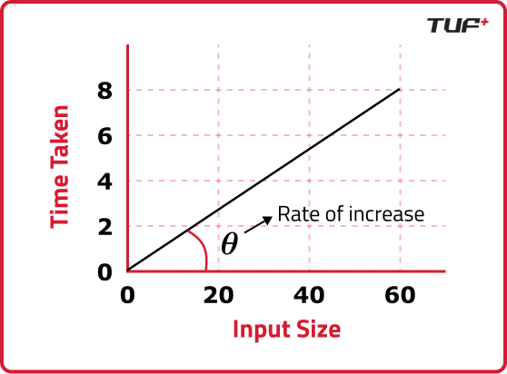

It's a way to find out how effecient our algorithm is by expressing how the execution time grows as the input size grows.

## Rate of change


The rate of change can be expressed as: `(input2 - input1) / (time2 - time1)`

The rate of change is what defines the time complexity. It's usually measured in `Big O` Notation which gives us the worst case scenario (can't go beyond it).

```java
for(int i=0;i<5;i++){
    System.out.println(i);
}
```

In the above code the time complexity will be O(5) as the loop will run exactly 5 times regardless of input size.However if the input size is `N` then time complexity will be `O(N)`

## Rules of Solving Time complexity

- Avoid Constants: In time complexity constant factors are ignored. Eg: for `O(5)` we will write `O(1)` since constants don't change with input size.
- Consider the worst case: While calculating time complexity we always consider worst case scenario as it gives us guarantee that it will not got further.

:::note
For a Linear search algorithm the worst case would be element is last or not at all present
:::

## Ways to measure time complexity

- `Big O`: Represents worst case scenario (Upper bound).
- `Theta(Θ)`: Represents Average case scenario.
- `Omega(Ω)`: Represent Best case scenario (Lower bound).

## Examples

- Simple for loop

    ```java
    for(int i=0;i<n;i++){
        System.out.print(i);
    }
    ```

    Time complexity : `O(n)`

- Nested for loop

    ```java
    for(int i=0;i<n;i++){
        for(int j=0;j<n;j++){
            System.out.print(i);
            System.out.print(j);
        }
    }
    ```

    Time Complexity: `O(n²)`

- Logarithmic

    ```java
        for(int i=1;i<n;i+=2){
            System.out.print(i);
        }
    ```

    Time Complexity: `O(log₂n)`

- Constant time operation

    ```java
    int sum = a + b;
    ```

    Time Complexity: `O(1)`

- Loop with early exit (worst case analysis)

    ```java
    for(int i=0;i<n;i++){
        if(arr[i] == target){
            break;
        }
    }
    ```

    Time complexity: `O(n)`

    In the above code the base case would be that target is first element and in worst case it would be last and hence the time complexity is `O(n)`.
